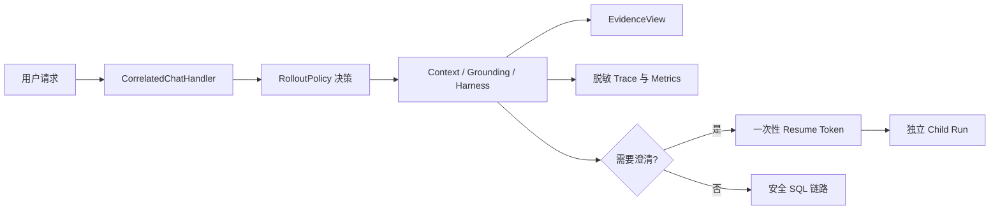

# 阶段 D 架构：体验、可观测与灰度发布

## 边界与不变量

阶段 D 在现有安全链路外增加证据展示、澄清续跑、脱敏遥测和请求级灰度决策。服务端生成同一个 UUID 作为 SSE `request_id` 与 Harness `run_id`；客户端不能覆盖数据库运行身份。既有 SSE wire format、JWT、审批、只读 SQL、5 秒超时和 200 行限制不变。

所有能力采用 `off|shadow|enforce`，全局默认 `shadow`。策略优先级固定为用户、tenant、角色、route/risk、全局，并用 `SHA-256(policy_version:user_id) mod 100` 稳定分桶。

## 数据流

Evidence API 只返回计划、资产 ID、来源 hash、版本、验证结果与裁剪原因。普通用户永远看不到 SQL；管理员 SQL 从 business-service 权威审计按需读取，不复制到 agent state。Drawer、trace 和评测结果均不保存 prompt、结果行、PII、JWT、连接串或 memory 正文。

澄清 token 仅返回一次，数据库只保存 SHA-256。原子 claim 同时验证 owner、parent/child 状态、有效期、operation kind 与消费状态；child 从 conversation 按 instruction hash 恢复原问题，并重新编译低权限选择证据。写操作和审批不能通过该入口恢复。

## 故障语义

- exporter 故障：shadow 仅记录本地错误；enforce 仅在本地 trace 也无法落库时拒绝。
- token 重放、过期、篡改、跨用户分别映射为 409、410、400、404。
- 自动降级只创建新策略版本，不删除历史数据或修改旧 run。
- 安全执行或跨用户泄露立即全局降级；性能、错误率与 provenance 异常仅影响命中的 cohort/route。
