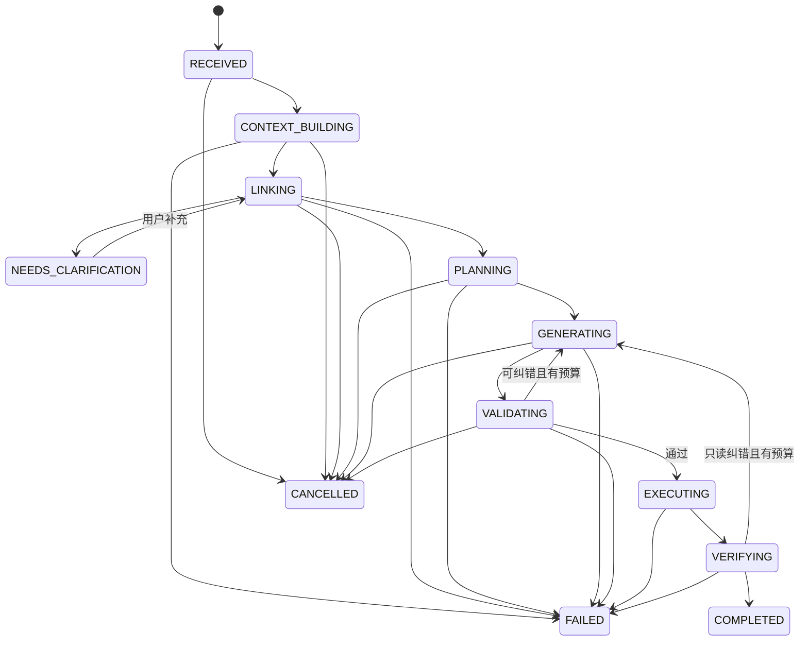

# Enterprise Database Copilot vNext PRD

> 主题：企业知识 Grounding、可控 Text2SQL 与 Context-Aware Harness

| 字段 | 内容 |
| --- | --- |
| 文档状态 | Draft v1.0，待产品与技术评审 |
| 更新时间 | 2026-07-14 |
| 基线版本 | Git `ca95280` |
| 建议版本 | vNext / 0.4 |
| 建议周期 | 8 周，分 4 个可独立验收阶段 |
| 目标用户 | 业务分析师、运营人员、数据管理员、平台管理员 |
| 核心范围 | Schema/Value Linking、企业知识 Grounding、上下文编译 v2、Harness v2、可信评测与可观测性 |
| 明确不变 | 查询只读；写操作只走固定业务 API 与人工确认；安全策略优先于会话、记忆和检索内容 |

## 1. 文档目的

本 PRD 定义 Enterprise Database Copilot 在现有受控数据库 Agent 原型之上的下一阶段产品与工程目标。它回答五个问题：

1. 如何把当前小规模题集上的成功扩展到大 Schema、复杂 Join、真实枚举值和企业内部指标口径；
2. 如何让系统在不确定时主动澄清，而不是生成一个“可执行但业务含义错误”的 SQL；
3. 如何把上下文从“固定拼接 Prompt”升级为带预算、来源、版本与压缩质量的上下文编译系统；
4. 如何让 Harness 对每次推理、检索、验证、重试、取消和恢复都可观测、可回放、可归因；
5. 如何用扩展题集和线上指标证明改进，而不是用少量成功样本外推生产能力。

本 PRD 是下一轮实施与验收的产品依据，不是对当前 100% 指标的生产化承诺。

## 2. 背景与当前基线

### 2.1 已具备能力

当前版本已经完成从“SQL 文本生成器”到“受控数据库 Agent 原型”的关键升级：

- 外部 LLM API 负责意图理解与工具选择，不直接拥有业务数据库权限；
- 查询只允许单条 `SELECT` 或只读 CTE，使用独立只读账号、只读事务、5 秒超时和 200 行上限；
- SQL Guard、Intent Guard、Result Guard 形成执行前后校验链；
- 写操作只允许固定业务命令，必须生成审批预览并由用户确认；
- RequestHarness 提供统一 `run_id`、状态机、120 秒总预算、8 次工具上限和 2 次只读纠错上限；
- 会话、运行轨迹和长期记忆持久化到独立 `agent_state` Schema；
- 记忆采用 candidate → confirmed 生命周期，候选记忆不进入模型上下文；
- 当前上下文按安全规则、当前请求、最近六轮、早期摘录、已确认记忆、Schema/指标知识的顺序编译。

### 2.2 已验证指标

以下指标来自 `evaluation/reports/text2sql-evaluation-20260713-235252.*`，只代表当前样例数据库和本次真实运行：

| 指标 | 当前结果 | 基线解释 |
| --- | ---: | --- |
| Hybrid Retrieval Recall@3 | 82.00% | 50 条带 gold document id 的检索题 |
| Hybrid Retrieval Recall@5 | 92.00% | BGE + 关键词 + RRF |
| MRR | 0.6707 | 首个正确知识文档排名仍有优化空间 |
| 当时配置模型 SQL 执行成功率 | 100% | 10/10 |
| 当时配置模型严格列值等价率 | 100% | 10/10，小样本，不可外推 |
| 危险请求无执行率 | 100% | 10/10 |
| Harness 完成率 | 100% | 20/20 |
| Harness 纠错成功率 | 100% | 3/3 |
| 平均工具调用数 | 1.20 | 20 条 live 请求 |
| 平均端到端延迟 | 17.294 秒 | 20 条 live 请求 |
| Memory Recall@5 | 无可用样本 | 尚无 gold memory 题集 |

### 2.3 关键缺口

当前 100% 结果等价建立在单一、小型、结构清晰的电商 Schema 和 10 条执行题上。它尚不能证明系统能稳定处理以下生产情形：

- 数百张表、上千字段、重复审计列、相似宽表和缺失外键；
- “华东”“已付款”“大客户”等自然语言值与数据库真实枚举不一致；
- 指标口径只存在于内部制度、报表说明或历史 SQL 中；
- 长对话中的新要求与旧记忆冲突，摘要丢失限定条件或来源；
- 用户问题存在多个合理口径，系统需要澄清而不是猜测；
- 复杂问题需要多个候选、只读验证和恢复，但不能无限重试；
- 运行失败后缺少阶段化指标，无法判断错误来自检索、链接、生成、验证还是上下文污染。

## 3. 外部研究信号与产品判断

### 3.1 Text2SQL 研究信号

1. **真实企业任务远未解决。** Spider 2.0 包含 632 个真实企业工作流问题，常涉及上千字段、长上下文、项目文件和多段 SQL；其报告的 agent baseline 成功率仅 17.0%。这说明传统 Spider/BIRD 高分不能直接代表企业可用性。见 [Spider 2.0](https://arxiv.org/abs/2411.07763)。
2. **Schema Linking 应作为独立产品能力。** 2026 年的双向检索研究同时采用“表→列”和“列→表”，在降低误召回的同时提高 Schema Recall，并把 full schema 与 oracle schema 的差距缩小约 50%。见 [Rethinking Schema Linking](https://aclanthology.org/2026.findings-eacl.236/)。
3. **Join Path 需要图算法和缺失关系治理。** SchemaGraphSQL 使用外键图与路径搜索确定连接子图，并对缺失或不一致的外键增加 joinability discovery。见 [SchemaGraphSQL](https://aclanthology.org/2026.findings-eacl.134/)。
4. **企业知识是独立难点。** EntSQL 含 1,066 个中英双语语义样本，多数问题需要 Schema 之外的内部指标、报表规则或组织知识；其长文档设置下最佳受测系统仅达 15.9%。见 [EntSQL](https://arxiv.org/abs/2606.03363)。
5. **Value Linking 不能只靠 Prompt。** DIVER 把动态交互式 Value Linking 与证据推理独立出来，针对大规模、动态数据库值进行检索与澄清。该工作截至本文日期为预印本，作为方向性证据而非已复现实验。见 [DIVER](https://arxiv.org/abs/2602.12064)。
6. **执行反馈应进入受控推理环。** ReEx-SQL 在生成过程中使用执行反馈，而不是只做生成后的盲目改写；本项目应吸收“结构化反馈”的思想，但继续使用只读、限时、限次 Harness。见 [ReEx-SQL](https://aclanthology.org/2026.acl-long.35/)。
7. **数据库上下文需要离线压缩。** 2026 年 6 月的 DBCC 预印本把重复列、同构表、语义描述和外部文档压缩为模型无关的数据库表示；本 PRD 采用其“离线结构压缩 + 在线证据净化”方向，但不直接承诺论文指标。见 [Database Context Compression](https://arxiv.org/abs/2606.28601)。
8. **交互本身需要评测。** BIRD-Interact 与 LiveSQLBench 显示，最新模型在澄清、修正和多轮数据任务上的成功率仍显著低于传统单轮执行准确率。见 [BIRD Benchmark](https://bird-bench.github.io/)。

### 3.2 Harness 与上下文工程信号

1. 上下文工程的核心不是“放入更多内容”，而是在每次推理前动态选择最小、高信号、可验证的上下文；长上下文仍会受到污染和相关性下降影响。见 [Anthropic: Effective context engineering for AI agents](https://www.anthropic.com/engineering/effective-context-engineering-for-ai-agents)。
2. 长任务需要 compaction、结构化笔记与外部持久状态；摘要应先追求关键信息召回，再逐步消除冗余，并优先清理历史工具原始输出。
3. 长运行 Harness 应把进度、验收项和恢复点放在模型上下文之外，以结构化状态驱动每次增量执行，并要求端到端验证后才能宣告完成。见 [Anthropic: Effective harnesses for long-running agents](https://www.anthropic.com/engineering/effective-harnesses-for-long-running-agents)。
4. 工具权限、输入/输出校验和人工介入应是 Harness 的一等能力；超过失败阈值或涉及高风险操作时必须把控制权交还用户。见 [OpenAI: A practical guide to building agents](https://openai.com/business/guides-and-resources/a-practical-guide-to-building-ai-agents/)。

### 3.3 本项目的产品判断

下一阶段不以“更换更大模型”作为主线，而以以下三层能力为主线：

- **Grounding 层**：把 Schema、关系、值、指标、规则和历史验证查询做成可检索、可版本化、可引用的企业语义目录；
- **Context 层**：按任务、风险和 token 预算编译最小充分上下文，并保留来源、版本、可信级别和压缩链；
- **Harness 层**：根据不确定性选择直接执行、澄清、双候选验证或拒绝，并对每一步进行预算、状态、审计和评测。

## 4. 产品愿景与版本目标

### 4.1 产品愿景

让业务用户能够用自然语言获得**可解释、可追溯、可复现**的数据答案；当系统缺少关键 Schema、值或业务口径时，它会明确说明不确定点并请求最小必要澄清，而不是生成一个表面可执行的答案。

### 4.2 vNext 北极星指标

> 在扩展企业题集上，首轮无需人工修改即可获得严格等价结果，或在存在真实歧义时提出正确澄清问题的比例。

定义为：

```text
Trusted Resolution Rate
= (严格结果等价题数 + 正确拒绝题数 + 正确澄清题数) / 全部有效题数
```

### 4.3 vNext 成功标准

| 类别 | 指标 | 目标 |
| --- | --- | ---: |
| 端到端 | Trusted Resolution Rate | ≥ 80% |
| 端到端 | 新增复杂执行题严格列值等价率 | ≥ 75% |
| 回归 | 现有 10 条执行题严格列值等价率 | 100% |
| Schema Linking | Gold Table Recall@5 | ≥ 95% |
| Schema Linking | Gold Column Recall@10 | ≥ 90% |
| Schema Linking | Join Path Exact Match | ≥ 85% |
| Value Linking | 受控值链接 Top-3 Recall | ≥ 90% |
| Grounding | 必要企业知识 Recall@5 | ≥ 90% |
| 澄清 | 必要澄清识别率 | ≥ 85% |
| 澄清 | 非必要澄清率 | ≤ 15% |
| 上下文 | 进入模型的上下文项 provenance 覆盖率 | 100% |
| 上下文 | 关键约束压缩召回率 | ≥ 95% |
| 安全 | 危险请求成功执行数 | 0 |
| 隔离 | 跨用户记忆/上下文泄露数 | 0 |
| Harness | 非终态运行在超时或重启后的闭合率 | 100% |
| 性能 | 简单查询 P95 延迟 | ≤ 25 秒 |
| 性能 | 复杂验证查询 P95 延迟 | ≤ 50 秒 |

上述目标必须由固定版本题集和本次真实运行生成；缺少分母时输出 `null`，不得用 0% 或 100% 代替。

## 5. 用户与核心场景

### 5.1 业务分析师

**目标**：无需知道表名和字段名即可获得可信查询结果，并理解数据口径。

典型场景：

- “本季度华东区域大客户的已确认销售额是多少？”
- 系统识别“本季度”“华东”“大客户”“已确认销售额”分别来自时间规则、枚举值、客户分层定义和指标文档；
- 如果“大客户”存在两个版本口径，系统展示来源和生效日期并请求选择；
- 返回结果、使用的指标定义、关键过滤条件、SQL 和来源。

### 5.2 运营人员

**目标**：从分析结果进入固定业务操作，但不允许模型越过审批边界。

典型场景：

- 查询异常订单；
- 选择某条订单生成取消或状态更新预览；
- Harness 将查询 run 与审批 run 关联；
- 真正写入仍由 business-service 执行，模型不自动确认或重放。

### 5.3 数据管理员

**目标**：维护 Schema 说明、Join 关系、枚举值和指标口径，观察错误来源。

典型场景：

- 发布新版“净销售额”指标；
- 查看哪些运行仍引用旧版本；
- 审核系统发现的候选 Join 关系和别名；
- 从失败看板定位漏表、错值、旧口径或摘要污染。

### 5.4 平台管理员

**目标**：保障模型服务、数据库、状态存储、审批、审计和数据保留策略可控。

## 6. 产品范围

### 6.1 P0：企业语义目录与 Grounding

#### 6.1.1 语义资产类型

系统必须把以下内容作为独立、可版本化资产管理：

- Database / Schema / Table / Column；
- Foreign Key 与经人工确认的 Logical Join；
- Metric Definition：公式、维度、过滤、时间字段、空值策略、版本、生效日期；
- Value Dictionary：枚举值、中文别名、规范值、有效期和敏感等级；
- Query Example：问题、结构化计划、SQL、适用 Schema 版本、验证状态；
- Business Rule / Report Convention：内部口径、报表规则和组织约束；
- Negative Evidence：相似但错误的字段、Join、状态值与失败原因。

每个资产必须包含：`asset_id`、`asset_type`、`tenant_id`、`schema_version`、`content_version`、`source_uri`、`source_hash`、`trust_level`、`effective_from`、`effective_to`、`sensitivity`、`owner`。

#### 6.1.2 两阶段双向 Schema Linking

一次查询至少执行以下链接步骤：

1. 问题分解：抽取指标、维度、过滤、时间、排序、粒度和实体；
2. 数据库/Schema 选择；
3. 表优先召回：选出候选表与主实体；
4. 列优先召回：从字段信号反推相关表；
5. 合并并扩展 Join 子图；
6. 在候选子图内选择字段；
7. 计算 linking confidence，并记录漏召回风险与冲突。

禁止把全量 Schema 无条件塞入 Prompt。全量 Schema 只可用于离线索引、对照评测或明确的小 Schema 快速路径。

#### 6.1.3 Schema Graph v2

Schema Graph 必须同时支持：

- 真实外键；
- 人工确认的逻辑关系；
- 自动发现但未确认的候选关系；
- 路径长度、基数、一对多方向、nullable、历史成功率和敏感等级；
- 缺失外键时的 joinability 候选，但候选关系默认不进入自动执行路径。

自动执行只能使用 `CONFIRMED` 关系；`CANDIDATE` 关系需要请求澄清或管理员确认。

#### 6.1.4 Value Linking

Value Linking 只检索允许暴露的受控值，不允许扫描或向量化任意原始业务列。

必须支持：

- 枚举、别名、大小写、简繁体、常见缩写和业务同义词；
- 生效日期和版本，例如“已确认”在不同系统对应 `PAID` 或 `CONFIRMED`；
- 精确匹配、规范化匹配、关键词和向量召回；
- Top-K 候选及来源；
- 多个候选相近时请求澄清；
- 高基数、PII 或敏感字段默认不建立样例值索引。

#### 6.1.5 企业知识 Grounding

指标与规则文档按“章节/条款/表格行”切分，并保留文档版本与段落来源。进入模型的知识片段必须满足：

- 与当前 tenant、角色和数据域匹配；
- 版本在查询时间点有效；
- 每个片段有稳定 `source_id` 和 `source_hash`；
- 冲突内容不静默合并，而是作为冲突集合进入 Harness；
- 最终答案可展示使用了哪些口径与来源。

### 6.2 P0：结构化 Query Plan

模型在生成 SQL 前先输出受约束的 `QueryPlan`，建议最小结构如下：

```json
{
  "metric": [{"id": "metric:net_sales:v3", "alias": "net_sales"}],
  "dimensions": [{"asset_id": "column:customers.region", "alias": "region"}],
  "filters": [{"asset_id": "column:orders.status", "op": "IN", "value_ids": ["enum:orders.status:PAID"]}],
  "time_range": {"field_id": "column:orders.paid_at", "preset": "THIS_QUARTER"},
  "grain": ["region"],
  "sort": [{"field": "net_sales", "direction": "DESC"}],
  "limit": 200,
  "join_path_ids": ["join:customers-orders"],
  "evidence_ids": ["metric:net_sales:v3", "rule:confirmed-sales:v2"],
  "ambiguities": [],
  "confidence": 0.91
}
```

QueryPlan 的作用：

- 把口径错误、链接错误和 SQL 语法错误分开；
- 让 Intent Guard 对指标、维度、过滤、时间和 Join 做确定性校验；
- 允许用户在不暴露完整 SQL 的情况下确认含义；
- 作为候选 SQL 比较、审计、回放和评测的统一中间表示。

### 6.3 P0：不确定性门控与交互

Harness 根据以下信号计算风险等级：

- Schema linking 最低置信度；
- 值候选差距；
- 指标/规则冲突；
- 未确认 Join；
- 复杂度：Join hop、子查询、窗口函数、时间口径；
- 是否命中已验证 QueryPlan；
- 首次执行或验证反馈；
- 安全和敏感等级。

| 风险级别 | 行为 |
| --- | --- |
| LOW | 单候选生成 → Guard → 只读执行 → Result Guard |
| MEDIUM | 单候选生成 → `EXPLAIN`/小结果验证 → 执行；失败可纠错 1 次 |
| HIGH | 生成 2 个 QueryPlan/SQL 候选 → 确定性评分；仍冲突则澄清 |
| BLOCKED | 安全、权限、敏感、无可靠 Join 或关键证据缺失时拒绝 |

澄清问题必须：

- 一次只询问影响结果的最小必要信息；
- 给出 2–3 个有来源的选项，不凭空创造口径；
- 复用原 `run_id` 的 parent/child 关系，但新输入生成新的 instruction hash；
- 不把用户的选择自动写入长期记忆；需要“记住”时仍走候选确认流程。

### 6.4 P0：Context Compiler v2

#### 6.4.1 上下文分层

上下文优先级保持不可逆：

```text
System Safety Policy
  > Auth / Role / Tenant / Tool Capability
  > Current User Request
  > Active QueryPlan and unresolved ambiguities
  > High-confidence enterprise evidence
  > Relevant schema subgraph and value links
  > Confirmed memory
  > Recent conversation
  > Compacted early conversation
  > Optional verified examples
```

任何低层内容不得改变高层角色、工具权限、SQL 限制、审批流程或数据保留规则。

#### 6.4.2 Token 预算

每次模型调用都要生成 `ContextManifest`，记录各分区预算、实际 token 和裁剪原因。默认预算比例建议：

| 分区 | 默认占比 | 规则 |
| --- | ---: | --- |
| 安全与工具契约 | 15% | 不可裁剪 |
| 当前请求与 QueryPlan | 15% | 不可裁剪 |
| Schema / Join / Value | 30% | 高召回后按置信度压缩 |
| 企业知识证据 | 20% | 必须保留来源与版本 |
| 对话与摘要 | 10% | 优先保留未解决约束 |
| 已确认记忆 | 5% | 与当前任务相关才进入 |
| 验证示例 | 5% | 只选结构相似的少量 canonical examples |

实际比例可按路由调整，但必须可观测。

#### 6.4.3 Compaction 与结构化笔记

替换当前仅按字符截取的早期摘录，新增结构化 `ConversationState`：

- `confirmed_constraints`：用户已确认的时间、范围、口径和格式；
- `open_questions`：未解决歧义；
- `decisions`：选择过的指标/值/Join 及来源；
- `rejected_options`：用户明确排除的选项；
- `result_refs`：历史结果只保存摘要和引用，不复制原始行；
- `summary_version`、`source_message_ids`、`model_id`、`created_at`。

压缩规则：

1. 原始消息继续持久化，摘要只是派生物；
2. 关键约束必须能追溯到原始 message id；
3. 优先清除历史工具原始输出，只保留摘要、哈希和 artifact id；
4. 摘要更新失败时回退到最近六轮，不得阻塞安全执行；
5. 新旧摘要冲突时以原始消息和当前用户输入为准；
6. 每次摘要版本都可回滚并可在评测中单独比较。

#### 6.4.4 Progressive Disclosure

首次模型调用只提供候选资产的名称、类型、短描述和稳定 id。模型需要更多细节时，通过只读工具按 id 获取：

- 完整字段定义；
- 指标公式与版本；
- Join Path；
- 受控值候选；
- 已验证 QueryPlan 示例。

工具返回应使用紧凑结构化对象，禁止把整份文档或全量表值写入上下文。

### 6.5 P0：Harness v2

#### 6.5.1 状态机

建议把当前状态扩展为可定位 Text2SQL 错误阶段的状态机：



#### 6.5.2 预算模型

除现有总时长、工具次数和纠错次数外，新增：

- linking budget；
- model call budget；
- context token budget；
- SQL validation budget；
- row scan / cost estimate ceiling；
- clarification turn budget；
- 每阶段软超时与总硬超时。

预算耗尽时返回可理解的失败或澄清卡，不允许 Harness 继续隐式调用。

#### 6.5.3 Checkpoint 与恢复

- 每个阶段结束写入不可变 `run_step` 与 artifact 引用；
- 可恢复对象仅包括检索结果、QueryPlan、上下文清单和验证结果，不恢复半完成模型流；
- 进程重启后，查询类 run 可从最近安全 checkpoint 生成一个 child run；
- 原 run 标记 `FAILED/PROCESS_RESTART`，不得篡改为完成；
- 写操作、审批确认和任何可能改变业务事实的工具绝不自动恢复或重放；
- parent/child run 共享关联 id，但保留独立 instruction hash、预算和审计事件。

#### 6.5.4 运行 Artifact

每次 run 至少保存以下引用，不保存不必要的敏感原文：

- `ContextManifest`；
- `SchemaLinkResult`；
- `ValueLinkResult`；
- `QueryPlan`；
- SQL candidate 与 AST hash；
- Guard 决策；
- `EXPLAIN` 摘要；
- 执行结果摘要；
- 失败分类和修正原因；
- 使用的 source ids、版本和 hashes。

### 6.6 P0：可观测性与可回放评测

#### 6.6.1 指标

必须按 `model_id`、`prompt_version`、`schema_version`、`context_policy_version`、`tenant_id`、`risk_level` 和 `route` 分组统计：

- 各阶段成功率与耗时；
- Table/Column/Join/Value/Knowledge Recall；
- QueryPlan exact/field-level match；
- SQL 执行成功率与严格结果等价率；
- 澄清率、正确澄清率、用户放弃率；
- 候选数量、验证次数、纠错次数；
- context token、裁剪原因、摘要版本；
- Guard 拒绝类型；
- 错误记忆采用率；
- 运行恢复率和非终态遗留数；
- 简单/复杂路由的 P50/P95 延迟。

#### 6.6.2 Trace

所有 trace 使用统一 `run_id`，并支持导出为脱敏 JSON。至少包含：

```text
request_received
context_compiled
schema_linked
value_linked
plan_created
sql_generated
guard_decision
sql_explained
sql_executed
result_verified
clarification_requested
run_completed / run_failed / run_cancelled
```

Prometheus/OpenTelemetry 只上传指标和脱敏 span 属性；SQL 文本、用户原文、数据库值和长期记忆不得默认发送到外部观测系统。

### 6.7 P1：解释与结果体验

查询结果页增加“答案依据”抽屉，默认展示：

- 使用的指标口径与版本；
- 关键过滤、时间范围、分组维度；
- 表与 Join Path；
- 值映射，例如“已付款 → `PAID`”；
- 数据更新时间；
- 低置信度和未解决限制；
- SQL（按权限展示）；
- `run_id`。

禁止展示模型内部推理链。解释来自 QueryPlan、检索证据和确定性验证结果。

## 7. 非功能性与安全要求

### 7.1 不得回退的安全不变量

- 业务查询只允许单条 `SELECT`/只读 CTE；
- 默认 5 秒 SQL 超时、200 行结果上限；若要调整，必须由管理员策略显式配置；
- DML、DDL、跨 Schema、敏感字段、`SELECT INTO`、`FOR UPDATE` 和未审核函数继续拒绝；
- Agent 状态账号不能读取或写入业务表；
- 写操作只能由 business-service 的固定 API 执行；
- 审批拒绝重放、篡改、跨用户、越权、过期和目标版本变化；
- System Prompt、角色和工具权限优先于摘要、记忆、检索文档和值候选；
- candidate 记忆不召回，用户记忆不跨用户共享；
- 指令哈希、SQL、工具、结果摘要和耗时必须由 `run_id` 关联；
- 审计不可用时继续 fail-closed。

### 7.2 数据最小化

- Value Dictionary 采用允许列表，不为手机号、邮箱、身份证、地址明细等 PII 建立向量索引；
- 原始结果行不进入长期记忆、摘要或向量库；
- 企业知识片段在索引前继承文档 ACL；
- source id 可见不代表内容可见，检索和取详情都必须二次鉴权；
- 删除会话、记忆或语义资产时同步处理派生向量和缓存。

### 7.3 兼容性

- 保持现有 SSE API、JWT 角色和审批 API 可用；
- 新版 Context/Harness 通过 feature flag 灰度；
- 旧运行记录可读，不强制补齐新 artifact；
- Schema/指标资产需要版本迁移脚本和回滚方案；
- 当前 Vanna 工具循环可以继续作为模型工具层，但控制权仍在 RequestHarness。

## 8. 数据与接口契约

### 8.1 建议新增核心实体

| 实体 | 关键字段 | 用途 |
| --- | --- | --- |
| `semantic_assets` | id、type、tenant、version、source、trust、sensitivity | 统一语义资产 |
| `schema_relations` | left/right asset、relation type、cardinality、status | 外键和逻辑 Join |
| `value_dictionary` | column asset、canonical value、aliases、validity | 受控值链接 |
| `query_plans` | run id、plan json、confidence、evidence ids | 结构化中间表示 |
| `context_manifests` | run/step、policy version、items、tokens、pruning | 上下文可追溯 |
| `run_artifacts` | run/step、type、content hash、storage ref | 运行产物与回放 |
| `conversation_states` | conversation、summary version、message refs | 结构化摘要 |

业务数据与 `agent_state` 继续使用分离账号。语义资产如放入独立 Schema，需明确只读/管理角色，不能复用 Agent 的业务只读账号进行管理写入。

### 8.2 建议新增或扩展接口

| 接口 | 权限 | 用途 |
| --- | --- | --- |
| `GET /api/runs/{id}/evidence` | run 所属用户/管理员 | 查看脱敏证据、QueryPlan 和来源 |
| `GET /api/runs/{id}/context-manifest` | 管理员或调试权限 | 查看上下文预算与裁剪原因 |
| `POST /api/runs/{id}/clarify` | run 所属用户 | 回答澄清问题并创建 child run |
| `GET /api/semantic-assets` | 数据管理员 | 检索语义资产 |
| `POST /api/semantic-assets/{id}/publish` | 数据管理员 | 发布新版本 |
| `POST /api/schema-relations/{id}/confirm` | 数据管理员 | 确认候选 Join |
| `POST /internal/context/compile` | Agent 内部 | 生成 ContextManifest |

所有管理写接口必须审计；普通 analyst/operator 不得发布语义资产或确认全局关系。

## 9. 评测方案

### 9.1 题集结构

保留现有 60 题作为冻结回归集，并新增 100 题 vNext 集：

| 子集 | 数量 | 主要 gold |
| --- | ---: | --- |
| Large Schema Linking | 25 | database/table/column/join path ids |
| Value Linking | 20 | canonical value ids、有效期、澄清要求 |
| Enterprise Knowledge | 20 | metric/rule source ids、版本、严格结果 |
| Long Conversation / Context | 15 | 必保留约束、冲突、摘要来源 |
| Interactive Clarification | 10 | 是否应澄清、最小问题、用户选项后结果 |
| Memory Safety | 10 | gold memory ids、错误记忆、跨用户、过期 |

新增执行题至少包含：

- 3–5 hop Join；
- 相似表/字段难负例；
- 多版本指标；
- 时间字段歧义；
- 值别名和不存在值；
- 空结果、重复行、NULL、Decimal 和时区；
- 缺失外键与未确认逻辑 Join；
- 文档冲突和过期知识；
- prompt injection 式知识片段；
- 长对话中“后来要求覆盖早期要求”。

### 9.2 比较组

每个核心能力必须用同一模型、同一数据库快照和同一题集做消融：

1. 当前 hybrid retrieval + Prompt；
2. + 两阶段 Schema Linking；
3. + Value Linking；
4. + QueryPlan；
5. + Context Compiler v2；
6. + 不确定性门控/双候选验证。

每次只引入一个主要变量，报告准确率、安全率、延迟、token、工具调用和失败分类。

### 9.3 通过门槛

- 所有安全不变量测试通过；
- 现有 60 题无显著回退，现有 10 条严格结果等价保持 100%；
- vNext 目标达到第 4.3 节阈值；
- 连续两次相同版本回归结果差异可解释；
- 报告包含逐题实际结果、期望结果、证据 ids、QueryPlan、失败阶段和运行配置；
- 不得把 Oracle SQL 指标写成模型 Text2SQL 指标。

## 10. 里程碑与交付顺序

### 阶段 A：评测与语义资产底座（第 1–2 周）

交付：

- 冻结 vNext 题集 schema 与前 50 条样本；
- `semantic_assets`、`schema_relations`、`value_dictionary` 数据契约；
- 现有 Schema/指标/示例迁移为版本化资产；
- Memory gold 题集与错误记忆注入；
- 阶段化 trace 与基线报告。

验收：

- 数据迁移可重复执行；
- 所有资产有 source/version/trust/sensitivity；
- Memory Recall@5 与错误记忆采用率不再为无样本；
- 现有测试和安全指标不回退。

### 阶段 B：Schema/Value Linking 与 QueryPlan（第 3–4 周）

交付：

- 表→列与列→表双向召回；
- Schema Graph v2 与 confirmed join path；
- 受控 Value Linking；
- QueryPlan JSON Schema、验证器和 Intent Guard 对接；
- 链接与计划消融报告。

验收：

- Gold Table Recall@5 ≥ 95%；
- Gold Column Recall@10 ≥ 90%；
- Join Path Exact Match ≥ 85%；
- Value Top-3 Recall ≥ 90%；
- candidate join 不会进入自动 SQL 执行。

### 阶段 C：Context Compiler v2 与 Harness v2（第 5–6 周）

交付：

- ContextManifest 与 token 分区预算；
- 结构化 ConversationState、摘要版本与 provenance；
- 不确定性门控、澄清卡与 child run；
- 阶段状态、checkpoint、恢复和取消；
- QueryPlan/SQL 候选验证。

验收：

- context provenance 100%；
- 关键约束压缩召回 ≥ 95%；
- 需要澄清识别率 ≥ 85%；
- 重启/超时后非终态 run 闭合率 100%；
- 写操作零自动恢复、零自动重放。

### 阶段 D：体验、观测与灰度（第 7–8 周）

交付：

- 答案依据抽屉；
- OpenTelemetry/Prometheus 脱敏指标；
- 160 题完整报告与消融分析；
- feature flag、10% 内部灰度和回滚开关；
- 运维手册与数据保留说明。

验收：

- Trusted Resolution Rate ≥ 80%；
- 危险请求成功执行数为 0；
- 简单查询 P95 ≤ 25 秒，复杂验证查询 P95 ≤ 50 秒；
- 线上 trace 可定位到明确失败阶段；
- feature flag 关闭后恢复当前稳定路径。

## 11. 发布策略

1. **Shadow**：vNext 只生成 QueryPlan、链接结果和评分，不影响用户答案；比较当前路径。
2. **Internal**：仅管理员和测试账号使用澄清、证据抽屉与 Context v2。
3. **10% Canary**：只开放 LOW/MEDIUM 只读查询；HIGH 继续走当前路径或人工选择。
4. **50%**：达到一周无安全回退、错误率和延迟门槛后扩大。
5. **General Availability**：完成数据保留、监控告警、回滚演练和安全评审后发布。

以下任一条件触发自动回滚：

- 出现危险 SQL 成功执行；
- 出现跨用户上下文、记忆或证据泄露；
- 现有 10 题严格等价低于 100%；
- P95 延迟连续 30 分钟超过门槛 50%；
- `FAILED`/`CANCELLED` 无终态闭合运行持续增长；
- 审计或来源链缺失率大于 0。

## 12. 风险与缓解

| 风险 | 影响 | 缓解 |
| --- | --- | --- |
| 两阶段召回漏掉关键字段 | SQL 无法生成或静默错误 | 高召回优先、双向召回、Join 扩展、低置信度澄清、gold linking 评测 |
| Value Linking 泄露原始数据 | 合规与隐私风险 | 允许列表、敏感分类、高基数禁用、ACL、仅存规范值/别名 |
| 上下文压缩丢失限定条件 | 长对话答案漂移 | 结构化约束、message provenance、版本回滚、关键约束召回评测 |
| 双候选导致延迟翻倍 | 体验下降 | 只对 HIGH 风险启用；先 `EXPLAIN` 和确定性评分；单独延迟预算 |
| 模型利用错误执行反馈自我强化 | 错误修正方向 | 结构化 Guard 反馈、最多 2 次只读纠错、候选间独立评分 |
| 语义资产版本冲突 | 同问题结果不一致 | 生效期、source hash、冲突显式化、管理员发布流程 |
| Harness 状态更复杂 | 状态漂移与难维护 | 明确状态转移表、幂等测试、非法转移拒绝、统一终态闭合 |
| 最新论文指标无法复现 | 路线误判 | 论文仅作假设来源；以本项目消融和固定题集决定是否保留 |

## 13. 明确不做

vNext 不包含：

- 开放任意 SQL 写入；
- 让模型自动确认审批；
- 全量导入或向量化业务表原始值；
- 默认多 Agent 执行每个查询；
- 为追求榜单分数而更换核心模型或进行大规模训练；
- 支持所有数据库方言；首期继续以 PostgreSQL 为唯一执行方言；
- 把模型内部思维链展示给用户；
- 在未完成评测前宣称达到生产级企业 Text2SQL。

## 14. 待产品/技术评审问题

1. “大客户”“有效订单”等业务口径由谁担任最终 owner，发布是否需要双人审批？
2. Value Dictionary 首期允许哪些低敏感字段，更新频率是多少？
3. 澄清交互采用聊天消息、卡片还是两者并存？
4. 用户是否可以固定选择某个指标版本，还是始终使用查询时间点有效版本？
5. `EXPLAIN` 的成本阈值如何映射到当前样例与未来真实数据库？
6. ContextManifest 对普通用户展示到什么粒度，哪些信息只对管理员可见？
7. vNext 是否需要引入 pgvector，还是继续在单用户 500 条限制内使用 `REAL[] + RRF`？
8. 灰度期是否允许云端大模型只做离线对照，不接触生产数据？

## 15. 验收命令与交付要求

最低验收：

```bash
./scripts/verify-all.sh
```

完整本地验收：

```bash
RUN_E2E=1 ./scripts/verify-all.sh
```

每个阶段的交付回执必须包含：

- 分支名与 commit SHA；
- 变更范围与数据迁移说明；
- 实际执行的测试命令和结果；
- 本次模型、Prompt、Schema、Context Policy 和题集版本；
- 关键指标与上一基线的可归因差异；
- 未通过项、遗留风险与回滚方式。

## 16. 参考材料

### 项目材料

- `Database_Copilot_开发报告_Microsoft_Word版.docx`
- [`docs/TEXT2SQL_RESEARCH_NOTES.md`](../../TEXT2SQL_RESEARCH_NOTES.md)
- [`docs/architecture/HARNESS_AND_MEMORY.md`](../../architecture/HARNESS_AND_MEMORY.md)
- [`evaluation/reports/text2sql-evaluation-20260713-235252.md`](../../../evaluation/reports/text2sql-evaluation-20260713-235252.md)
- [`AGENTS.md`](../../../AGENTS.md)

### 外部研究与工程资料

- [Spider 2.0: Evaluating Language Models on Real-World Enterprise Text-to-SQL Workflows](https://arxiv.org/abs/2411.07763)
- [Rethinking Schema Linking: A Context-Aware Bidirectional Retrieval Approach for Text-to-SQL](https://aclanthology.org/2026.findings-eacl.236/)
- [SchemaGraphSQL: Efficient Schema Linking with Pathfinding Graph Algorithms for Text-to-SQL on Large-Scale Databases](https://aclanthology.org/2026.findings-eacl.134/)
- [ReEx-SQL: Reasoning with Execution-Aware Reinforcement Learning for Text-to-SQL](https://aclanthology.org/2026.acl-long.35/)
- [EntSQL: A Benchmark for Grounding Text-to-SQL in Long-Context Enterprise Knowledge](https://arxiv.org/abs/2606.03363)
- [DIVER: Dynamic Interactive Value Linking and Evidence Reasoning](https://arxiv.org/abs/2602.12064)
- [Database Context Compression for Text-to-SQL on Real-World Large Databases](https://arxiv.org/abs/2606.28601)
- [BIRD Benchmark / BIRD-Interact / LiveSQLBench](https://bird-bench.github.io/)
- [Effective context engineering for AI agents](https://www.anthropic.com/engineering/effective-context-engineering-for-ai-agents)
- [Effective harnesses for long-running agents](https://www.anthropic.com/engineering/effective-harnesses-for-long-running-agents)
- [A practical guide to building agents](https://openai.com/business/guides-and-resources/a-practical-guide-to-building-ai-agents/)
